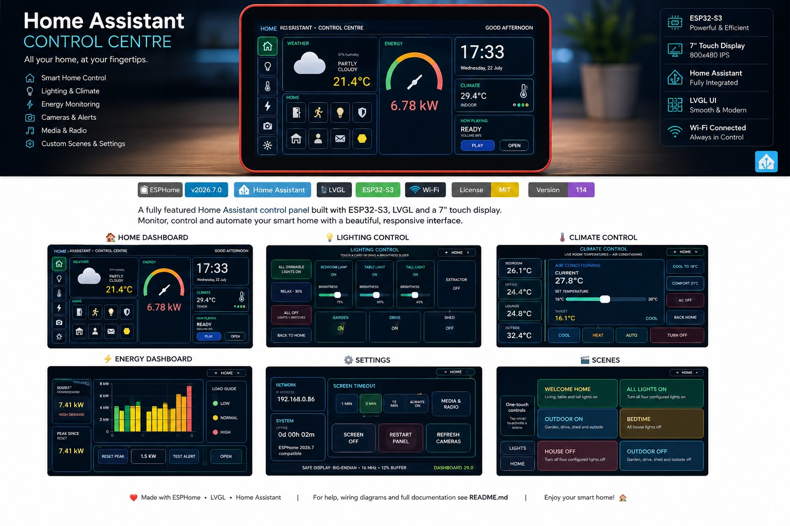

# Waveshare ESP32-S3 Home Assistant Panel

A full-screen ESPHome and LVGL dashboard for the Waveshare ESP32-S3 Touch
LCD 7-inch panel.

## Features

- 800 × 480 touch dashboard
- Home Assistant lighting and switch controls
- Climate controls
- Met Office weather and five-day forecast
- Home energy display and high-power alerts
- Camera proxy images
- Alarm, person, parcel and doorbell notifications
- Media player using a MAX98357A I2S amplifier
- Modern embedded startup sound
- Clock screensaver
- Bin collection information

## Screenshot



## Licence and usage

This project is shared for personal, educational and hobby use.

**Commercial use is not permitted without the author's permission.**

## Hardware

- Waveshare ESP32-S3 Touch LCD 7-inch
- MAX98357A I2S amplifier
- Suitable speaker
- Home Assistant with ESPHome Device Builder

## Repository contents

```text
waveshare-home-panel.yaml
sounds/
docs/
secrets.yaml.example
CHANGELOG.md
LICENSE
```

## Important before compiling

This repository includes all four WAV files referenced by the dashboard.
The YAML may also reference image and font assets from your existing ESPHome
installation; keep those assets in their matching folders before validating.

Never commit your real `secrets.yaml` or Home Assistant access token.

## Installation

See [docs/INSTALLATION.md](docs/INSTALLATION.md).

## Uploading to GitHub

See [docs/GITHUB_UPLOAD.md](docs/GITHUB_UPLOAD.md).

## Wiring

See [docs/WIRING.md](docs/WIRING.md).

## Version

Current project version: **v120 — Modern startup audio**
